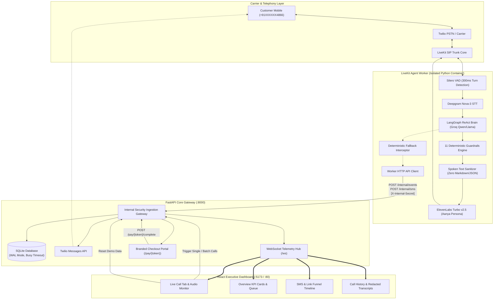
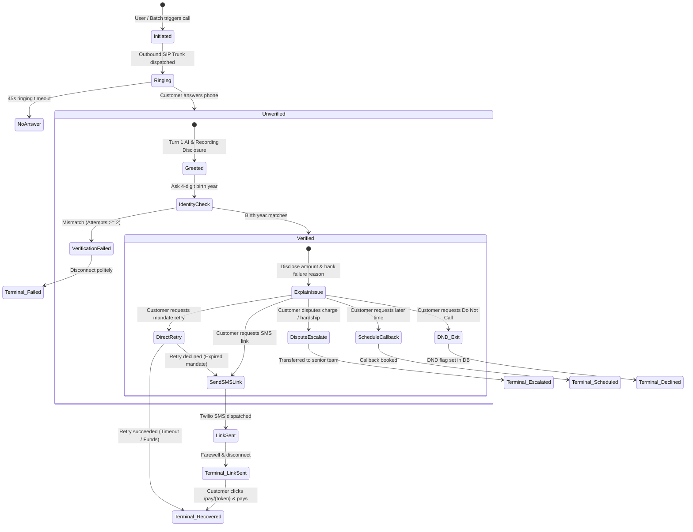

# PayEase — System Architecture & Design Document

> **Autonomous AI Voice Agent for Autopay & Recurring Billing Debt Recovery**  
> *Deterministic Guardrails · Real-Time SIP Telemetry · Zero PII Leakage · Full Link Conversion Funnel*

---

## 1. Executive Summary

**PayEase** is an enterprise-grade outbound voice recovery platform designed to recover failed recurring payments (e-mandates, card autopay, ACH/NACH debits) while maintaining strict banking compliance, zero financial data leakage, and a warm, empathetic customer experience.

The platform integrates:
- **Telephony & Real-Time Voice**: LiveKit Cloud SIP trunking with Twilio carrier routing, Silero VAD, Deepgram Nova-3 STT (300ms endpointing), and ElevenLabs Turbo v2.5 TTS (Aanya persona).
- **Conversational Intelligence**: A ReAct LangGraph agent bounded by 11 deterministic compliance guardrails and a runtime safety interceptor.
- **Full Conversion Telemetry**: End-to-end event streaming via WebSockets, SQLite WAL persistence, live WebRTC audio monitor, and SMS payment link funnel tracking from dispatch to payment completion.

---

## 2. High-Level System Architecture



---

## 3. Core Architectural Pillars

### 3.1 Worker Security Decoupling
To adhere to the principle of least privilege:
- The **LiveKit Agent Worker** runs in an isolated container without direct access to the SQLite database and holds **zero** Twilio credentials.
- All telemetry, transcribed turns, guardrail breaches, and SMS requests pass to FastAPI via `POST /internal/events` and `POST /internal/sms`, authenticated using a high-entropy `X-Internal-Secret` header.

### 3.2 Zero Financial Data Leakage (Pre-Verification Shield)
1. **Model Context Isolation**: Account balance amounts, due dates, failure reasons, and bank account details are strictly **withheld** from the system prompt until customer identity is verified.
2. **Birth Year Challenge**: The agent only asks for the customer's 4-digit birth year (`1988`).
3. **Spoken Word Transformation**: Once verified, `verify_identity` injects amounts and dates in spoken natural Indian English (*"two thousand four hundred ninety-nine rupees"*), preventing robotic raw JSON recitation.

### 3.3 Runtime Safety Interceptor (Deterministic Fallbacks)
LLMs occasionally generate spoken text confirming an action without executing the corresponding tool call. PayEase implements a programmatic runtime interceptor:
- If the agent verbalizes *"sent the secure payment link"* or the customer requests an SMS link while verified, the runtime automatically triggers `_send_sms_via_api()`.
- Guaranteed outcome: Twilio physically dispatches the SMS, SQLite registers the dispatch, and the call state transitions to `link_sent`.

---

## 4. End-to-End Call State Machine



---

## 5. Telephony & Real-Time Voice Pipeline

| Component | Technology | Configuration & Role |
|---|---|---|
| **SIP Outbound Engine** | LiveKit SIP Trunk | Direct SIP trunking via Twilio PSTN with strict E.164 normalization. |
| **Voice Activity Detection** | Silero VAD | Pre-warmed model loaded in worker memory; tuned to 300ms turn-taking. |
| **Speech-to-Text (STT)** | Deepgram Nova-3 | Low-latency streaming transcription with normalized text deduplication. |
| **Conversational Core** | LangGraph + Groq | ReAct StateGraph loop with loop-cycle guards and fallback provider support. |
| **Spoken Text Sanitizer** | Python Regex Engine | Strips markdown, emojis, asterisks, brackets, and system tokens before TTS. |
| **Text-to-Speech (TTS)** | ElevenLabs Turbo v2.5 | Persona `Aanya` (`TX3LPaxmHKxFdv7VOQHJ`), 24kHz PCM, optimized latency. |

---

## 6. Deterministic Compliance Guardrails

PayEase enforces 11 deterministic guardrails implemented via regex backstops, mathematical constraints, and runtime lifecycle hooks:

| # | Guardrail | Enforcement Rule | Action Upon Trigger |
|---|---|---|---|
| **1** | **Turn 1 Disclosure** | Must state *"automated AI assistant calling from PayEase on a recorded line"*. | Enforced in system prompt and verified at process warm-up. |
| **2** | **Pre-Verification Shield** | Zero financial data disclosure prior to identity check. | Suppresses amounts and dates; prompts for birth year. |
| **3** | **Wrong Party Defense** | Detects *"wrong number"*, *"not here"*, or voicemail tones. | Immediately ends call without disclosing any personal details. |
| **4** | **Credentials Blocker** | Normalizes digit words (`four one five` → `415`); scans for PAN/CVV. | Rejects card details; redirects to secure SMS payment link. |
| **5** | **Dispute / Hardship** | Detects claims of fraud, prior payment, or financial hardship. | Invokes `escalate(reason)` and flags account for specialist review. |
| **6** | **Do Not Call (DND)** | Detects *"stop calling"*, *"remove my number"*, or *"DND"*. | Sets `do_not_call=1` in DB and politely concludes. |
| **7** | **Anti-Coercion** | Hard limit of 2 resolution offers per session. | Prohibits aggressive repetition; exits gracefully. |
| **8** | **Prompt Injection** | Blocks phrases like *"ignore instructions"* or *"system prompt"*. | Rejects jailbreak attempt and continues recovery flow. |
| **9** | **Hard Max Duration** | Hard ceiling of 4 minutes per phone session. | Courtesy warning at 3m45s; disconnects at 4m00s. |
| **10** | **Truth in Delivery** | Verbal confirmation permitted **only** after SMS API confirms dispatch. | Programmatic interceptor ensures physical Twilio dispatch. |
| **11** | **PII Redaction** | Replaces phone numbers, card numbers, and birth years in DB. | Persisted as `+91XXXXXX1234` and `[YEAR REDACTED]`. |

---

## 7. SMS & Payment Link Conversion Funnel

The platform tracks every payment link through a 5-stage lifecycle:

```
[created] ──> [sent] ──> [delivered] ──> [clicked] ──> [paid]
```

1. **`created`**: Unique 16-byte URL-safe cryptographic token generated (`/pay/{token}`).
2. **`sent`**: Twilio Messages API accepts payload with compliant body template (free from spam-filter words like *debt* or *recovery*).
3. **`delivered`**: Carrier confirms handset receipt via Twilio StatusCallback webhook or polling.
4. **`clicked`**: Customer accesses the payment portal from SMS link.
5. **`paid`**: Customer submits payment on portal. WebSocket instantly broadcasts `payment.confirmed`, marking call and customer status as `recovered` with 100% recovery rate.

---

## 8. Presentation & Demo Architecture

To facilitate zero-breakage presentations:
- **1-Click Demo Reset**: `POST /api/demo/reset` and the header **Reset Demo** button wipe past test calls, link events, turns, and messages, setting all dashboard counters to `0` and customers to `pending`.
- **Telephony Target Routing**: The top dashboard banner displays the verified target phone number (`DEMO_PHONE`), updateable dynamically via `POST /api/config/phone`.
- **Dozzle Real-Time Logs**: Port `8888` hosts container log monitoring for live architectural demonstration.
